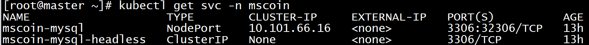
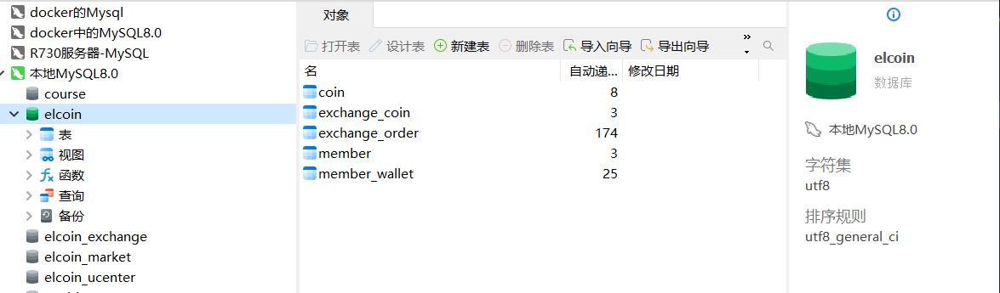
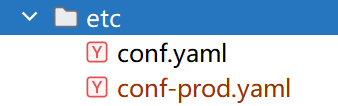

# 数字货币交易系统-server服务端

## 00. 项目简介

技术栈：Vue、go-zero、Gorm、MySQL、Redis、MongoDB、Kafka、WebSocket、Kubernetes、EFK、harbor、Jenkins、Istio

- 简介：在线数字货币交易平台基本实现了实时交易数据获取和展示，以及币币交易的市价和限价自动撮合交易，借助BitCoin测试网络实时同步区块数据，实现交易校验、序列化和广播，交易详情均可在测试网络中查询。
- 安全高效的用户管理：采用JWT技术实现状态保持，引入Vaptcha人机验证机制，有效抵御恶意攻击与机器人注册。手机验证码通过Redis存储并设置合理的过期时间。用户关键信息及数字货币设定数据则存储在MySQL数据库中，海量交易数据通过MongoDB进行高效管理。
- 智能交易处理与数据推送：系统根据交易方式管理买卖队列，执行资金冻结、订单自动匹配及状态更新。利用gocron包封装了多种粒度的定时任务，确保交易数据按时更新至MongoDB。同时，通过WebSocket技术实现交易数据的实时前端推送，图表展示。
- 高效消息传递与数据去重：引入Kafka作为消息总线，高效处理定时交易数据与用户交易信息的传递。利用Kafka的幂等操作特性，结合序列号与服务端缓存比对机制，确保了消息的有序性与数据去重，提升了系统的稳定性与可靠性。
- 云原生技术整合：在原有项目基础上，积极探索并初步实现了云原生架构的整合。通过本地GitLab、Jenkins及Pipeline脚本，构建了完整的CI/CD流程，实现了代码的自动化管理、测试、打包、构建Docker镜像、推送至Harbor仓库及部署至Kubernetes集群。通过Prometheus对Kubernetes集群及其组件进行健康监控，通过邮件告警系统及时发现并处理潜在问题。采用EFK日志架构，实现了日志的后端存储、分析与高效查询。此外，项目还接入了Istio Service Mesh，实现了服务的高扩展性、安全性、流量管理及可观察性，便于平台的持续优化与扩展。


## 01. 项目部署环境

#### k8s环境

我们需要先部署一个k8s集群，使用的环境为

* 本地机器配置，3台机器 配置 8g内存 master 100g存储空间 60g存储空间
* 使用k8s1.24版本（容器运行时环境 containerd）

详细安装过程可以看这个：[kubernetes](https://www.yuque.com/twilikiss/k8s-study/gpheh70d8louq7ot)

```shell
[root@master ~]# kubectl get nodes
NAME     STATUS   ROLES                AGE    VERSION
master   Ready    control-plane,edge   20d   v1.24.0
node1    Ready    <none>               20d   v1.24.0
node2    Ready    <none>               20d   v1.24.0
```


#### gitlab

代码都会进行统一的管理，一般常用的就是gitlab，这是绝大公司选用的方式，我们通过k8s来安装一个gitlab。

详细的安装过程可以看这个：[gitlab](https://www.yuque.com/twilikiss/devops-study/ggarr0h48gbolu97)

```go
192.168.0.51 minio.test.com
192.168.0.51 gitlab.test.com
192.168.0.51 gitlabci.test.com
```


#### harbor

go+云原生（容器时代），打包为镜像，镜像有镜像仓库 hub.docker.com

harbor是一个开源的镜像仓库，我们将其用于存储打包的镜像。

详细的安装过程可以看这个：[harbor](https://www.yuque.com/twilikiss/k8s-study/onazgqax32tbvapc)

```go
192.168.0.51 testharbor.com
```


## 01. 部署项目中间件

#### 部署MySQL

首先确保nfs已经安装并且启动：

~~~shell
/data/elcoin *(insecure,rw,sync,no_root_squash)
/data/elcoin/mysql *(insecure,rw,sync,no_root_squash)
/data/elcoin/redis *(insecure,rw,sync,no_root_squash)
/data/elcoin/kafka *(insecure,rw,sync,no_root_squash)
/data/elcoin/etcd *(insecure,rw,sync,no_root_squash)
/data/elcoin/mongo *(insecure,rw,sync,no_root_squash)
~~~

elcoin-rbac.yaml:

~~~yaml
apiVersion: v1
kind: ServiceAccount
metadata:
  name: bitcoin-nfs-client-provisioner
  namespace: elcoin      
---
kind: ClusterRole
apiVersion: rbac.authorization.k8s.io/v1
metadata:
  name: bitcoin-nfs-client-provisioner-runner
rules:
  - apiGroups: [""]
    resources: ["persistentvolumes"]
    verbs: ["get", "list", "watch", "create", "delete"]
  - apiGroups: [""]
    resources: ["persistentvolumeclaims"]
    verbs: ["get", "list", "watch", "update"]
  - apiGroups: ["storage.k8s.io"]
    resources: ["storageclasses"]
    verbs: ["get", "list", "watch"]
  - apiGroups: [""]
    resources: ["events"]
    verbs: ["create", "update", "patch"]
---
kind: ClusterRoleBinding
apiVersion: rbac.authorization.k8s.io/v1
metadata:
  name: bitcoin-run-nfs-client-provisioner
subjects:
  - kind: ServiceAccount
    name: bitcoin-nfs-client-provisioner
    namespace: elcoin
roleRef:
  kind: ClusterRole
  name: bitcoin-nfs-client-provisioner-runner
  apiGroup: rbac.authorization.k8s.io
---
kind: Role
apiVersion: rbac.authorization.k8s.io/v1
metadata:
  name: bitcoin-leader-locking-nfs-client-provisioner
  namespace: elcoin
rules:
  - apiGroups: [""]
    resources: ["endpoints"]
    verbs: ["get", "list", "watch", "create", "update", "patch"]
---
kind: RoleBinding
apiVersion: rbac.authorization.k8s.io/v1
metadata:
  name: bitcoin-leader-locking-nfs-client-provisioner
  namespace: elcoin
subjects:
  - kind: ServiceAccount
    name: bitcoin-nfs-client-provisioner
    namespace: elcoin
roleRef:
  kind: Role
  name: bcoin-leader-locking-nfs-client-provisioner
  apiGroup: rbac.authorization.k8s.io
~~~


elcoin-storageclass.yaml:

~~~yaml
apiVersion: storage.k8s.io/v1
kind: StorageClass
metadata:
  name: elcoin-nfs-storage
provisioner: elcoin-nfs-storage
parameters:
  archiveOnDelete: "true"
reclaimPolicy: Retain
~~~

elcoin-nfs-provisioner.yaml

~~~yaml
apiVersion: apps/v1
kind: Deployment
metadata:
  name: elcoin-nfs-client-provisioner
  labels:
    app: elcoin-nfs-client-provisioner
  namespace: elcoin
spec:
  replicas: 1
  strategy:
    type: Recreate
  selector:
    matchLabels:
      app: elcoin-nfs-client-provisioner
  template:
    metadata:
      labels:
        app: elcoin-nfs-client-provisioner
    spec:
      serviceAccountName: elcoin-nfs-client-provisioner
      containers:
        - name: elcoin-nfs-client-provisioner
          image: registry.cn-hangzhou.aliyuncs.com/lfy_k8s_images/nfs-subdir-external-provisioner:v4.0.2
          volumeMounts:
            - name: nfs-client-root
              mountPath: /persistentvolumes
          env:
            - name: PROVISIONER_NAME
              value: elcoin-nfs-storage
            - name: NFS_SERVER
              value: 192.168.200.101 ## 指定自己nfs服务器地址
            - name: NFS_PATH  
              value: /data/elcoin  ## nfs服务器共享的目录
      volumes:
        - name: nfs-client-root
          nfs:
            server: 192.168.200.101
            path: /data/elcoin
~~~


mysql-configmap.yaml:

~~~yaml
apiVersion: v1
kind: ConfigMap
metadata:
  name: elcoin-mysql-config
  namespace: elcoin
  labels:
    app: mysql
data:
  my.cnf: |-
    [client]
    default-character-set=utf8mb4
    [mysql]
    default-character-set=utf8mb4
    [mysqld]
    max_connections = 2000
    secure_file_priv=/var/lib/mysql
    sql_mode=STRICT_TRANS_TABLES,NO_ZERO_IN_DATE,NO_ZERO_DATE,ERROR_FOR_DIVISION_BY_ZERO,NO_ENGINE_SUBSTITUTION
    skip-name-resolve
    open_files_limit = 65535
    table_open_cache = 128
    log_error = /var/lib/mysql/mysql-error.log #错误日志路径
    slow_query_log = 1
    long_query_time = 1 #慢查询时间 超过1秒则为慢查询
    slow_query_log_file = /var/lib/mysql/mysql-slow.log
    default-storage-engine = InnoDB #默认存储引擎
    innodb_file_per_table = 1
    innodb_open_files = 500
    innodb_buffer_pool_size = 64M
    innodb_write_io_threads = 4
    innodb_read_io_threads = 4
    innodb_thread_concurrency = 0
    innodb_purge_threads = 1
    innodb_flush_log_at_trx_commit = 2
    innodb_log_buffer_size = 2M
    innodb_log_file_size = 32M
    innodb_log_files_in_group = 3
    innodb_max_dirty_pages_pct = 90
    innodb_lock_wait_timeout = 120
    bulk_insert_buffer_size = 8M
    myisam_sort_buffer_size = 8M
    myisam_max_sort_file_size = 10G
    myisam_repair_threads = 1
    interactive_timeout = 28800
    wait_timeout = 28800
    [mysqldump]
    quick
    max_allowed_packet = 16M #服务器发送和接受的最大包长度
    [myisamchk]
    key_buffer_size = 8M
    sort_buffer_size = 8M
    read_buffer = 4M
    write_buffer = 4M
~~~

mysql-statefulset.yaml：

~~~yaml
apiVersion: v1
kind: Service
metadata:
  namespace: elcoin
  name: elcoin-mysql-headless
spec:
  clusterIP: None  #无头服务
  selector:
    app: elcoin-mysql
  ports:
  - name: mysql
    port: 3306
    protocol: TCP
---
apiVersion: apps/v1
kind: StatefulSet
metadata:
  namespace: elcoin
  name: elcoin-mysql
spec:
  podManagementPolicy: OrderedReady  #pod名-> 0-N,删除N->0
  replicas: 1
  revisionHistoryLimit: 10
  serviceName: elcoin-mysql-headless
  selector:
    matchLabels:
      app: elcoin-mysql
  template:
    metadata:  #name没写，会默认生成的
      labels:
        app: elcoin-mysql
    spec:
      containers:
      - name: elcoin-mysql
        image: mysql:8.0.19
        ports:
        - containerPort: 3306
          name: client
        env:
        - name: MYSQL_ROOT_PASSWORD    ## 配置Root用户默认密码
          value: "root"
        livenessProbe:
          initialDelaySeconds: 30
          periodSeconds: 10
          timeoutSeconds: 5
          successThreshold: 1
          failureThreshold: 3
          exec:
            command: ["mysqladmin", "-uroot", "-p${MYSQL_ROOT_PASSWORD}", "ping"]
        readinessProbe:
          initialDelaySeconds: 10
          periodSeconds: 10
          timeoutSeconds: 5
          successThreshold: 1
          failureThreshold: 3
          exec:
            command: ["mysqladmin", "-uroot", "-p${MYSQL_ROOT_PASSWORD}", "ping"]
        volumeMounts:
        - name: conf
          mountPath: /etc/mysql/conf.d/my.cnf
          subPath: my.cnf
        - name: data
          mountPath: /var/lib/mysql
          readOnly: false
        - name: localtime
          readOnly: true
          mountPath: /etc/localtime
      volumes:
      - name: conf
        configMap:
          name: elcoin-mysql-config
          defaultMode: 0755
      - name: localtime
        hostPath:
           type: File
           path: /etc/localtime
  volumeClaimTemplates:
  - metadata:
      name: data
    spec:
      accessModes: ["ReadWriteMany"]
      storageClassName: elcoin-nfs-storage
      volumeMode: Filesystem
      resources:
        requests:
          storage: 1Gi
~~~


mysql-service.yaml：

~~~yaml
apiVersion: v1
kind: Service
metadata:
  name: elcoin-mysql
  namespace: elcoin
  labels:
    app: elcoin-mysql
spec:
  type: NodePort
  ports:
    - name: tcp
      port: 3306
      nodePort: 32306
  selector:
    app: elcoin-mysql
~~~



连接后，将数据库导入进去：



> 这时候，我们访问`elcoin-mysql-0.elcoin-mysql-headless.elcoin.svc.cluster.local:3306`即可访问到mysql数据库


#### 部署Redis

redis-configmap.yaml

~~~yaml
apiVersion: v1
kind: ConfigMap
metadata:
  name: elcoin-redis-conf
  namespace: elcoin
data:
  redis.conf: |
    protected-mode no
    port 6379
    tcp-backlog 511
    timeout 0
    tcp-keepalive 300
    daemonize no
    pidfile /var/run/redis_6379.pid
    loglevel notice
    logfile "/var/log/redis-6379.log"
    databases 16
    always-show-logo no
    set-proc-title yes
    proc-title-template "{title} {listen-addr} {server-mode}"
    stop-writes-on-bgsave-error yes
    rdbcompression yes
    rdbchecksum yes
    dbfilename dump.rdb
    rdb-del-sync-files no
    dir /data/redis
    replica-serve-stale-data yes
    replica-read-only yes
    repl-diskless-sync no
    repl-diskless-sync-delay 5
    repl-diskless-load disabled
    repl-disable-tcp-nodelay no
    replica-priority 100
    acllog-max-len 128
    lazyfree-lazy-eviction no
    lazyfree-lazy-expire no
    lazyfree-lazy-server-del no
    replica-lazy-flush no
    lazyfree-lazy-user-del no
    lazyfree-lazy-user-flush no
    oom-score-adj no
    oom-score-adj-values 0 200 800
    disable-thp yes
    appendonly no
    appendfilename "appendonly.aof"
    appendfsync everysec
    no-appendfsync-on-rewrite no
    auto-aof-rewrite-percentage 100
    auto-aof-rewrite-min-size 64mb
    aof-load-truncated yes
    aof-use-rdb-preamble yes
    lua-time-limit 5000
    slowlog-log-slower-than 10000
    slowlog-max-len 128
    latency-monitor-threshold 0
    notify-keyspace-events ""
    hash-max-ziplist-entries 512
    hash-max-ziplist-value 64
    list-max-ziplist-size -2
    list-compress-depth 0
    set-max-intset-entries 512
    zset-max-ziplist-entries 128
    zset-max-ziplist-value 64
    hll-sparse-max-bytes 3000
    stream-node-max-bytes 4096
    stream-node-max-entries 100
    activerehashing yes
    client-output-buffer-limit normal 0 0 0
    client-output-buffer-limit replica 256mb 64mb 60
    client-output-buffer-limit pubsub 32mb 8mb 60
    hz 10
    dynamic-hz yes
    aof-rewrite-incremental-fsync yes
    rdb-save-incremental-fsync yes
    jemalloc-bg-thread yes
~~~

redis-statefulset.yaml:

~~~yaml
apiVersion: apps/v1
kind: StatefulSet
metadata:
  name: elcoin-redis
  namespace: elcoin
spec:
  podManagementPolicy: OrderedReady
  replicas: 1
  selector:
    matchLabels:
      name: elcoin-redis
      app: elcoin-redis-server
  serviceName: elcoin-redis-hs
  template:
    metadata:
      labels:
        name: elcoin-redis
        app: elcoin-redis-server
    spec:
      containers:
        - name: elcoin-redis
          image: redis:6.2.7
          imagePullPolicy: IfNotPresent
          command:
            - sh
            - -c
            - "exec redis-server /data/conf/redis.conf"
          ports:
            - containerPort: 6379
              name: redis
              protocol: TCP
          volumeMounts:
            - mountPath: /data/conf/
              name: elcoin-redis-config
            - mountPath: /data/redis/
              name: data
      volumes:
        - name: elcoin-redis-config
          configMap:
            name: elcoin-redis-conf
  volumeClaimTemplates:
  - metadata:
      name: data
    spec:
      accessModes: ["ReadWriteMany"]
      storageClassName: elcoin-nfs-storage
      volumeMode: Filesystem
      resources:
        requests:
          storage: 1Gi
~~~

redis-service.yaml

~~~yaml
apiVersion: v1
kind: Service
metadata:
  name: elcoin-redis-hs
  namespace: elcoin
  labels:
    name: elcoin-redis-server
spec:
  ports:
    - name: redis
      port: 6379
      protocol: TCP
  clusterIP: None  
  selector:
    name: elcoin-redis
    app: elcoin-redis-server 
~~~

> 可以通过`elcoin-redis-0.elcoin-redis-hs.elcoin.svc.cluster.local：6379`访问redis


#### 部署ETCD

etcd.yaml：

~~~yaml
kind: Service
apiVersion: v1
metadata:
  name: elcoin-etcd3-hs
  namespace: elcoin
spec:
  selector:
    app: elcoin-etcd
  clusterIP: None
  ports:
  - port: 2379
    name: etcd-client
    targetPort: 2379
  - port: 2380
    name: peer
    targetPort: 2380
---
apiVersion: apps/v1
kind: StatefulSet
metadata:
  name: elcoin-etcd
  namespace: elcoin
spec:
  podManagementPolicy: OrderedReady
  replicas: 1
  selector:
    matchLabels:
      name: elcoin-etcd
      app: elcoin-etcd
  serviceName: elcoin-etcd3-hs
  template:
    metadata:
      labels:
        name: elcoin-etcd
        app: elcoin-etcd
    spec:
      containers:
      - name: elcoin-etcd
        image: bitnami/etcd:3.5.7
        imagePullPolicy: IfNotPresent
        ports:
        - containerPort: 2379
          name: client
        - containerPort: 2380
          name: peer
        env:
        - name: ALLOW_NONE_AUTHENTICATION
          value: "yes"
        - name: ETCD_INITIAL_CLUSTER
          value: default=http://elcoin-etcd-0.elcoin-etcd3-hs.elcoin.svc.cluster.local:2380
        - name: ETCD_ADVERTISE_CLIENT_URLS
          value: "http://elcoin-etcd-0.elcoin-etcd3-hs.elcoin.svc.cluster.local:2379"
        - name: ETCD_INITIAL_ADVERTISE_PEER_URLS
          value: "http://elcoin-etcd-0.elcoin-etcd3-hs.elcoin.svc.cluster.local:2380"
        volumeMounts:
          - mountPath: /bitnami/etcd/data
            name: data
  volumeClaimTemplates:
  - metadata:
      name: data
    spec:
      accessModes: ["ReadWriteMany"]
      storageClassName: elcoin-nfs-storage
      volumeMode: Filesystem
      resources:
        requests:
          storage: 1Gi
~~~

> 可以通过`elcoin-etcd-0.elcoin-etcd3-hs.elcoin.svc.cluster.local：2379`进行访问


#### 部署Kafka

先部署zookeeper：

zk.yaml:

~~~yaml
kind: Service
apiVersion: v1
metadata:
  name: elcoin-zk-hs
  namespace: elcoin
spec:
  selector:
    app: elcoin-zk
  clusterIP: None
  ports:
  - port: 2181
    name: zk
    targetPort: 2181
---
apiVersion: apps/v1
kind: StatefulSet
metadata:
  name: elcoin-zk
  namespace: elcoin
spec:
  selector:
    matchLabels:
      app: elcoin-zk
  serviceName: elcoin-zk-hs
  replicas: 1
  template:
    metadata:
      labels:
        app: elcoin-zk
    spec:
      containers:
      - name: elcoin-zk
        imagePullPolicy: Always
        image: bitnami/zookeeper:3.6.3
        ports:
        - containerPort: 2181
          name: client
        env:
        - name: ALLOW_ANONYMOUS_LOGIN
          value: "yes"
        volumeMounts:
        - name: data
          mountPath: /bitnami/zookeeper
      securityContext:
        runAsUser: 1000
        fsGroup: 1000
  volumeClaimTemplates:
    - metadata:
        name: data
      spec:
        storageClassName: elcoin-nfs-storage     
        accessModes:
          - "ReadWriteOnce"
        resources:
          requests:
            storage: 1Gi
~~~


接着部署kafka：

kafka.yaml：

~~~yaml
kind: Service
apiVersion: v1
metadata:
  name: elcoin-kafka-hs
  namespace: elcoin
spec:
  selector:
    app: elcoin-kafka
  clusterIP: None
  ports:
  - port: 9092
    name: kafka-server
    targetPort: 9092
---
apiVersion: apps/v1
kind: StatefulSet
metadata:
  name: elcoin-kafka
  namespace: elcoin
  labels:
    app: elcoin-kafka
spec:
  selector:
    matchLabels:
      app: elcoin-kafka
  serviceName: elcoin-kafka-hs
  podManagementPolicy: "Parallel"
  replicas: 1
  updateStrategy:
    type: "RollingUpdate"
  template:
    metadata:
      name: elcoin-kafka
      labels:
        app: elcoin-kafka
    spec:      
      securityContext:
        fsGroup: 1001
        runAsUser: 1001
      containers:
      - name: elcoin-kafka
        image: "docker.io/bitnami/kafka:2.3.0-debian-9-r4"
        imagePullPolicy: "IfNotPresent"
        env:
        - name: MY_POD_IP
          valueFrom:
            fieldRef:
              fieldPath: status.podIP
        - name: MY_POD_NAME
          valueFrom:
            fieldRef:
              fieldPath: metadata.name
        - name: KAFKA_CFG_ZOOKEEPER_CONNECT
          value: "elcoin-zk-hs"                     
        - name: KAFKA_PORT_NUMBER 
          value: "9092"
        - name: KAFKA_CFG_LISTENERS
          value: "PLAINTEXT://:$(KAFKA_PORT_NUMBER)"
        - name: KAFKA_CFG_ADVERTISED_LISTENERS
          value: 'PLAINTEXT://$(MY_POD_NAME).elcoin-kafka-hs:$(KAFKA_PORT_NUMBER)'
        - name: ALLOW_PLAINTEXT_LISTENER
          value: "yes"
        - name: KAFKA_HEAP_OPTS
          value: "-Xmx512m -Xms512m"
        - name: KAFKA_CFG_LOGS_DIRS
          value: /opt/bitnami/kafka/data
        - name: JMX_PORT
          value: "9988"
        ports:
        - name: kafka
          containerPort: 9092
        livenessProbe:
          tcpSocket:
            port: kafka
          initialDelaySeconds: 10
          periodSeconds: 10
          timeoutSeconds: 5
          successThreshold: 1
          failureThreshold: 2
        readinessProbe:
          tcpSocket:
            port: kafka
          initialDelaySeconds: 5
          periodSeconds: 10
          timeoutSeconds: 5
          successThreshold: 1
          failureThreshold: 6
        volumeMounts:
        - name: data
          mountPath: /bitnami/kafka
  volumeClaimTemplates:
    - metadata:
        name: data
      spec:
        storageClassName: elcoin-nfs-storage     
        accessModes:
          - "ReadWriteOnce"
        resources:
          requests:
            storage: 5Gi
~~~

> 通过`elcoin-kafka-0.elcoin-kafka-hs.elcoin.svc.cluster.local:9092`可以访问kafka


#### 部署MongoDB

mongo.yaml

~~~yaml
apiVersion: v1
kind: Service
metadata:
  namespace: elcoin
  name: elcoin-mongo-hs
spec:
  clusterIP: None  #无头服务
  selector:
    app: elcoin-mongo
  ports:
  - name: mongo
    port: 27017
    protocol: TCP
---
apiVersion: apps/v1
kind: StatefulSet
metadata:
  namespace: elcoin
  name: elcoin-mongo
spec:
  podManagementPolicy: OrderedReady  #pod名-> 0-N,删除N->0
  replicas: 1
  revisionHistoryLimit: 10
  serviceName: elcoin-mongo-hs
  selector:
    matchLabels:
      app: elcoin-mongo
  template:
    metadata:  
      labels:
        app: elcoin-mongo
    spec:
      containers:
      - name: elcoin-mongo
        image: mongo:4.2.1
        ports:
        - containerPort: 27017
          name: client
        env:
        - name: MONGO_INITDB_ROOT_USERNAME   
          value: "root"
        - name: MONGO_INITDB_ROOT_PASSWORD   
          value: "root123456"
        volumeMounts:
        - name: data
          mountPath: /data/db
          readOnly: false
  volumeClaimTemplates:
  - metadata:
      name: data
    spec:
      accessModes: ["ReadWriteMany"]
      storageClassName: elcoin-nfs-storage
      volumeMode: Filesystem
      resources:
        requests:
          storage: 1Gi
~~~

> 通过`elcoin-mongo-0.elcoin-mongo-hs.elcoin.svc.cluster.local：27017`进行访问


#### 部署BitCoin

先将之前的代码中bitcoin的访问地址改为可配置的

~~~go
type BitCoinConfig struct {
	Address string
}
~~~

~~~yaml
Bitcoin:
  Address: http://127.0.0.1:18332
~~~

~~~go
type Config struct {
	Okx        logic.OkxConfig
	Mongo      database.MongoConfig
	Kafka      database.KafkaConfig
	CacheRedis cache.CacheConf
	UCenterRpc zrpc.RpcClientConf
	Bitcoin    logic.BitCoinConfig
}
~~~

然后将涉及到写死地址的地方改为中配置文件读取即可。

bitcoin.yaml

~~~yaml
apiVersion: v1
kind: Service
metadata:
  namespace: elcoin
  name: elcoin-bitcoin-hs
spec:
  clusterIP: None  #无头服务
  selector:
    app: elcoin-bitcoin
  ports:
  - name: testrpc
    port: 18332
    targetPort: 18332
    protocol: TCP
---
apiVersion: apps/v1
kind: StatefulSet
metadata:
  namespace: elcoin
  name: elcoin-bitcoin
spec:
  podManagementPolicy: OrderedReady  #pod名-> 0-N,删除N->0
  replicas: 1
  revisionHistoryLimit: 10
  serviceName: elcoin-bitcoin-hs
  selector:
    matchLabels:
      app: elcoin-bitcoin
  template:
    metadata:  
      labels:
        app: elcoin-bitcoin
    spec:
      containers:
      - name: elcoin-bitcoin
        image: ruimarinho/bitcoin-core
        ports:
        - containerPort: 18332
          name: rpc
        args:
        - -rpcallowip=0.0.0.0/0
        - -rpcuser=bitcoin
        - -rpcpassword=123456
        - -testnet=1
        - -txindex=1
        - -maxtxfee=0.01
        - -fallbackfee=0.00002
        - -mintxfee=0.00000002
        - -paytxfee=0.00002
        env:
        - name: BITCOIN_DATA   
          value: /data
        volumeMounts:
        - name: data
          mountPath: /data
          readOnly: false
  volumeClaimTemplates:
  - metadata:
      name: data
    spec:
      accessModes: ["ReadWriteMany"]
      storageClassName: elcoin-nfs-storage
      volumeMode: Filesystem
      resources:
        requests:
          storage: 50Gi
~~~

> 通过`elcoin-bitcoin-hs.elcoin.svc.cluster.local:18332`访问bitcoin的rpc


## 03. 部署应用

打包镜像之前，配置文件做一个prod环境，替换为上述的地址




### 5.1 Docker镜像制作

> 注意放在和go.work一级的目录中

Dockerfile_exchange:

~~~dockerfile
FROM registry.cn-hangzhou.aliyuncs.com/mszlu/go:1.19 AS build-stage
WORKDIR /app
COPY . ./
RUN go env -w GO111MODULE=on
RUN go env -w GOPROXY=https://goproxy.cn,direct
RUN go mod download
RUN CGO_ENABLED=0 GOOS=linux go build  -o /exchange exchange/main.go
FROM registry.cn-hangzhou.aliyuncs.com/mszlu-gcrio/distroless_base-debian11 AS build-release-stage
WORKDIR /
COPY --from=build-stage /exchange /exchange
COPY --from=build-stage /etc/conf-prod.yaml etc/conf-prod.yaml
EXPOSE 8083
USER nonroot:nonroot
ENTRYPOINT ["/exchange -f /etc/conf-prod.yaml"]
~~~

Dockerfile_exchange-api:

~~~dockerfile
FROM registry.cn-hangzhou.aliyuncs.com/mszlu/go:1.19 AS build-stage
WORKDIR /app
COPY . ./
RUN go env -w GO111MODULE=on
RUN go env -w GOPROXY=https://goproxy.cn,direct
RUN go mod download
RUN CGO_ENABLED=0 GOOS=linux go build  -o /exchange-api exchange-api/main.go
FROM registry.cn-hangzhou.aliyuncs.com/mszlu-gcrio/distroless_base-debian11 AS build-release-stage
WORKDIR /
COPY --from=build-stage /exchange-api /exchange-api
COPY --from=build-stage /etc/conf-prod.yaml etc/conf-prod.yaml
EXPOSE 8890
USER nonroot:nonroot
ENTRYPOINT ["/exchange-api -f /etc/conf-prod.yaml"]
~~~

Dockerfile_market

~~~dockerfile
FROM registry.cn-hangzhou.aliyuncs.com/mszlu/go:1.19 AS build-stage
WORKDIR /app
COPY . ./
RUN go env -w GO111MODULE=on
RUN go env -w GOPROXY=https://goproxy.cn,direct
RUN go mod download
RUN CGO_ENABLED=0 GOOS=linux go build  -o /market market/main.go
FROM registry.cn-hangzhou.aliyuncs.com/mszlu-gcrio/distroless_base-debian11 AS build-release-stage
WORKDIR /
COPY --from=build-stage /market /market
COPY --from=build-stage /etc/conf-prod.yaml etc/conf-prod.yaml
EXPOSE 8082
USER nonroot:nonroot
ENTRYPOINT ["/market -f /etc/conf-prod.yaml"]
~~~

Dockerfile_market-api

~~~dockerfile
FROM registry.cn-hangzhou.aliyuncs.com/mszlu/go:1.19 AS build-stage
WORKDIR /app
COPY . ./
RUN go env -w GO111MODULE=on
RUN go env -w GOPROXY=https://goproxy.cn,direct
RUN go mod download
RUN CGO_ENABLED=0 GOOS=linux go build  -o /market-api market-api/main.go
FROM registry.cn-hangzhou.aliyuncs.com/mszlu-gcrio/distroless_base-debian11 AS build-release-stage
WORKDIR /
COPY --from=build-stage /market-api /market-api
COPY --from=build-stage /etc/conf-prod.yaml etc/conf-prod.yaml
EXPOSE 8889
USER nonroot:nonroot
ENTRYPOINT ["/market-api -f /etc/conf-prod.yaml"]
~~~

Dockerfile_user

~~~dockerfile
FROM registry.cn-hangzhou.aliyuncs.com/mszlu/go:1.19 AS build-stage
WORKDIR /app
COPY . ./
RUN go env -w GO111MODULE=on
RUN go env -w GOPROXY=https://goproxy.cn,direct
RUN go mod download
RUN CGO_ENABLED=0 GOOS=linux go build  -o /user ucenter/main.go
FROM registry.cn-hangzhou.aliyuncs.com/mszlu-gcrio/distroless_base-debian11 AS build-release-stage
WORKDIR /
COPY --from=build-stage /user /user
COPY --from=build-stage /etc/conf-prod.yaml etc/conf-prod.yaml
EXPOSE 8081
USER nonroot:nonroot
ENTRYPOINT ["/user -f /etc/conf-prod.yaml"]
~~~

Dockerfile_user-api

~~~dockerfile
FROM registry.cn-hangzhou.aliyuncs.com/mszlu/go:1.19 AS build-stage
WORKDIR /app
COPY . ./
RUN go env -w GO111MODULE=on
RUN go env -w GOPROXY=https://goproxy.cn,direct
RUN go mod download
RUN CGO_ENABLED=0 GOOS=linux go build  -o /user-api ucenter-api/main.go
FROM registry.cn-hangzhou.aliyuncs.com/mszlu-gcrio/distroless_base-debian11 AS build-release-stage
WORKDIR /
COPY --from=build-stage /user-api /user-api
COPY --from=build-stage /etc/conf-prod.yaml etc/conf-prod.yaml
EXPOSE 8888
USER nonroot:nonroot
ENTRYPOINT ["/user-api -f /etc/conf-prod.yaml"]
~~~

Dockerfile_jobcenter

~~~dockerfile
FROM registry.cn-hangzhou.aliyuncs.com/mszlu/go:1.19 AS build-stage
WORKDIR /app
COPY . ./
RUN go env -w GO111MODULE=on
RUN go env -w GOPROXY=https://goproxy.cn,direct
RUN go mod download
RUN CGO_ENABLED=0 GOOS=linux go build  -o /jobcenter jobcenter/main.go
FROM registry.cn-hangzhou.aliyuncs.com/mszlu-gcrio/distroless_base-debian11 AS build-release-stage
WORKDIR /
COPY --from=build-stage /jobcenter /jobcenter
COPY --from=build-stage /etc/conf-prod.yaml etc/conf-prod.yaml
USER nonroot:nonroot
ENTRYPOINT ["/jobcenter -f /etc/conf-prod.yaml"]
~~~

### 5.2 上传gitlab代码自动打包

当上传代码，我们需要触发gitlab的CI/CD功能，构建pipeline，完成打包镜像，上传harbor以及部署k8s的操作。

所以需要在项目根目录写一个.gitlab-ci.yml文件，用于说明我们要做的事情：

~~~yaml
stages:
  - build
  - deploy
variables:
  GOPATH: ${CI_PROJECT_DIR}/.go
before_script:
  - mkdir -p .go
.cache:
  key: ${CI_JOB_NAME}
  paths:
    - .go/pkg/mod/
########################### build阶段 ###########################
build_image:
  image:  registry.cn-hangzhou.aliyuncs.com/twilikiss/kaniko-project-executor:v1.9.0-debug
  stage: build
  tags:
    - k8s
  script:
    - mkdir -p /kaniko/.docker
    - echo "{\"auths\":{\"https://testharbor.com\":{\"auth\":\"YWRtaW46SGFyYm9yMTIzNDU=\"}}}" > /kaniko/.docker/config.json
    - /kaniko/executor --context "${CI_PROJECT_DIR}" --dockerfile "${CI_PROJECT_DIR}/Dockerfile_user" --destination "testharbor.com/elcoin/ucenter:${CI_COMMIT_SHA}" --skip-tls-verify
    - echo "ucenter上传harbor"
    - /kaniko/executor --context "${CI_PROJECT_DIR}" --dockerfile "${CI_PROJECT_DIR}/Dockerfile_user-api" --destination "testharbor.com/elcoin/ucenter-api:${CI_COMMIT_SHA}" --skip-tls-verify
    - echo "ucenter-api上传harbor"
    - /kaniko/executor --context "${CI_PROJECT_DIR}" --dockerfile "${CI_PROJECT_DIR}/Dockerfile_market" --destination "testharbor.com/elcoin/market:${CI_COMMIT_SHA}" --skip-tls-verify
    - echo "market上传harbor"
    - /kaniko/executor --context "${CI_PROJECT_DIR}" --dockerfile "${CI_PROJECT_DIR}/Dockerfile_market-api" --destination "testharbor.com/elcoin/market-api:${CI_COMMIT_SHA}" --skip-tls-verify
    - echo "market-api上传harbor"
    - /kaniko/executor --context "${CI_PROJECT_DIR}" --dockerfile "${CI_PROJECT_DIR}/Dockerfile_exchange" --destination "testharbor.com/elcoin/exchange:${CI_COMMIT_SHA}" --skip-tls-verify
    - echo "exchange上传harbor"
    - /kaniko/executor --context "${CI_PROJECT_DIR}" --dockerfile "${CI_PROJECT_DIR}/Dockerfile_exchange-api" --destination "testharbor.com/elcoin/exchange-api:${CI_COMMIT_SHA}" --skip-tls-verify
    - echo "exchange-api上传harbor"
    - /kaniko/executor --context "${CI_PROJECT_DIR}" --dockerfile "${CI_PROJECT_DIR}/Dockerfile_jobcenter" --destination "testharbor.com/elcoin/jobcenter:${CI_COMMIT_SHA}" --skip-tls-verify
    - echo "jobcenter上传harbor"
########################### deploy阶段 ###########################
deploy_image:
  image:  registry.cn-hangzhou.aliyuncs.com/twilikiss/kubectl:1.24.0
  stage: deploy
  tags:
    - k8s
  script:
    - echo "开始部署elcoin k8s"
    - sed -i "s#{VERSION}#${CI_COMMIT_SHA}#g" ./k8s-elcoin.yaml
    - kubectl apply -f ./k8s-elcoin.yaml -n elcoin
~~~


对应的`k8s-elcoin.yaml`

```yaml
apiVersion: apps/v1
kind: Deployment
metadata:
  name: elcoin-exchange-deployment
  namespace: elcoin
  labels:
    app: exchange
spec:
  selector:
    matchLabels:
      app: exchange
  replicas: 3
  minReadySeconds: 5
  strategy:
    type: RollingUpdate
    rollingUpdate:
      maxSurge: 1
      maxUnavailable: 1
  template:
    metadata:
      labels:
        app: exchange
    spec:
      containers:
        - image: testharbor.com/elcoin/exchange:{VERSION}
          name: exchange
          imagePullPolicy: Always
          ports:
            - containerPort: 8083
              protocol: TCP
---
apiVersion: apps/v1
kind: Deployment
metadata:
  name: elcoin-exchange-api-deployment
  namespace: elcoin
  labels:
    app: exchange-api
spec:
  selector:
    matchLabels:
      app: exchange-api
  replicas: 1
  minReadySeconds: 5
  strategy:
    type: RollingUpdate
    rollingUpdate:
      maxSurge: 1
      maxUnavailable: 1
  template:
    metadata:
      labels:
        app: exchange-api
    spec:
      containers:
        - image: testharbor.com/elcoin/exchange-api:{VERSION}
          name: exchange-api
          imagePullPolicy: Always
          ports:
            - containerPort: 8890
              protocol: TCP
---
apiVersion: apps/v1
kind: Deployment
metadata:
  name: elcoin-market-deployment
  namespace: elcoin
  labels:
    app: market
spec:
  selector:
    matchLabels:
      app: market
  replicas: 3
  minReadySeconds: 5
  strategy:
    type: RollingUpdate
    rollingUpdate:
      maxSurge: 1
      maxUnavailable: 1
  template:
    metadata:
      labels:
        app: market
    spec:
      containers:
        - image: testharbor.com/elcoin/market:{VERSION}
          name: market
          imagePullPolicy: Always
          ports:
            - containerPort: 8082
              protocol: TCP
---
apiVersion: apps/v1
kind: Deployment
metadata:
  name: elcoin-market-api-deployment
  namespace: elcoin
  labels:
    app: market-api
spec:
  selector:
    matchLabels:
      app: market-api
  replicas: 3
  minReadySeconds: 5
  strategy:
    type: RollingUpdate
    rollingUpdate:
      maxSurge: 1
      maxUnavailable: 1
  template:
    metadata:
      labels:
        app: market-api
    spec:
      containers:
        - image: testharbor.com/elcoin/market-api:{VERSION}
          name: market-api
          imagePullPolicy: Always
          ports:
            - containerPort: 8889
              protocol: TCP
---
apiVersion: apps/v1
kind: Deployment
metadata:
  name: elcoin-user-deployment
  namespace: elcoin
  labels:
    app: user
spec:
  selector:
    matchLabels:
      app: user
  replicas: 3
  minReadySeconds: 5
  strategy:
    type: RollingUpdate
    rollingUpdate:
      maxSurge: 1
      maxUnavailable: 1
  template:
    metadata:
      labels:
        app: user
    spec:
      containers:
        - image: testharbor.com/elcoin/ucenter:{VERSION}
          name: market
          imagePullPolicy: Always
          ports:
            - containerPort: 8081
              protocol: TCP
---
apiVersion: apps/v1
kind: Deployment
metadata:
  name: elcoin-user-api-deployment
  namespace: elcoin
  labels:
    app: user-api
spec:
  selector:
    matchLabels:
      app: user-api
  replicas: 3
  minReadySeconds: 5
  strategy:
    type: RollingUpdate
    rollingUpdate:
      maxSurge: 1
      maxUnavailable: 1
  template:
    metadata:
      labels:
        app: user-api
    spec:
      containers:
        - image: testharbor.com/elcoin/ucenter-api:{VERSION}
          name: user-api
          imagePullPolicy: Always
          ports:
            - containerPort: 8888
              protocol: TCP
---
apiVersion: apps/v1
kind: Deployment
metadata:
  name: elcoin-jobcenter-deployment
  namespace: elcoin
  labels:
    app: jobcenter
spec:
  selector:
    matchLabels:
      app: jobcenter
  replicas: 1
  minReadySeconds: 5
  strategy:
    type: RollingUpdate
    rollingUpdate:
      maxSurge: 1
      maxUnavailable: 1
  template:
    metadata:
      labels:
        app: jobcenter
    spec:
      containers:
        - image: testharbor.com/elcoin/jobcenter:{VERSION}
          name: jobcenter
          imagePullPolicy: Always
---
apiVersion: v1
kind: Endpoints
metadata:
  name: elcoin-proxy-hs
  namespace: elcoin
subsets:
  - addresses:
      - ip: 192.168.200.1
    ports:
      - port: 10809
---
apiVersion: v1
kind: Service
metadata:
  name: elcoin-proxy-hs
  namespace: elcoin
spec:
  clusterIP: None
  type: ClusterIP
  ports:
    - port: 10809
      targetPort: 10809
---
apiVersion: v1
kind: Service
metadata:
  name: elcoin-exchange-api-service
  namespace: elcoin
spec:
  selector:
    app: exchange-api
  type: ClusterIP
  ports:
    - port: 8890
      targetPort: 8890
---
apiVersion: v1
kind: Service
metadata:
  name: elcoin-market-api-service
  namespace: elcoin
spec:
  selector:
    app: market-api
  type: ClusterIP
  ports:
    - port: 8889
      targetPort: 8889
---
apiVersion: v1
kind: Service
metadata:
  name: elcoin-user-api-service
  namespace: elcoin
spec:
  selector:
    app: user-api
  type: ClusterIP
  ports:
    - port: 8888
      targetPort: 8888
---
apiVersion: networking.k8s.io/v1
kind: Ingress
metadata:
  name: elcoin-ingress-http
  namespace: elcoin
spec:
  rules:
    - host: elcoin.test.com
      http:
        paths:
          - path: /exchange
            pathType: Prefix
            backend:
              service:
                name: elcoin-exchange-api-service
                port:
                  number: 8890
          - path: /market
            pathType: Prefix
            backend:
              service:
                name: elcoin-market-api-service
                port:
                  number: 8889
          - path: /socket.io
            pathType: Prefix
            backend:
              service:
                name: elcoin-market-api-service
                port:
                  number: 8889
          - path: /uc
            pathType: Prefix
            backend:
              service:
                name: elcoin-user-api-service
                port:
                  number: 8888
```

